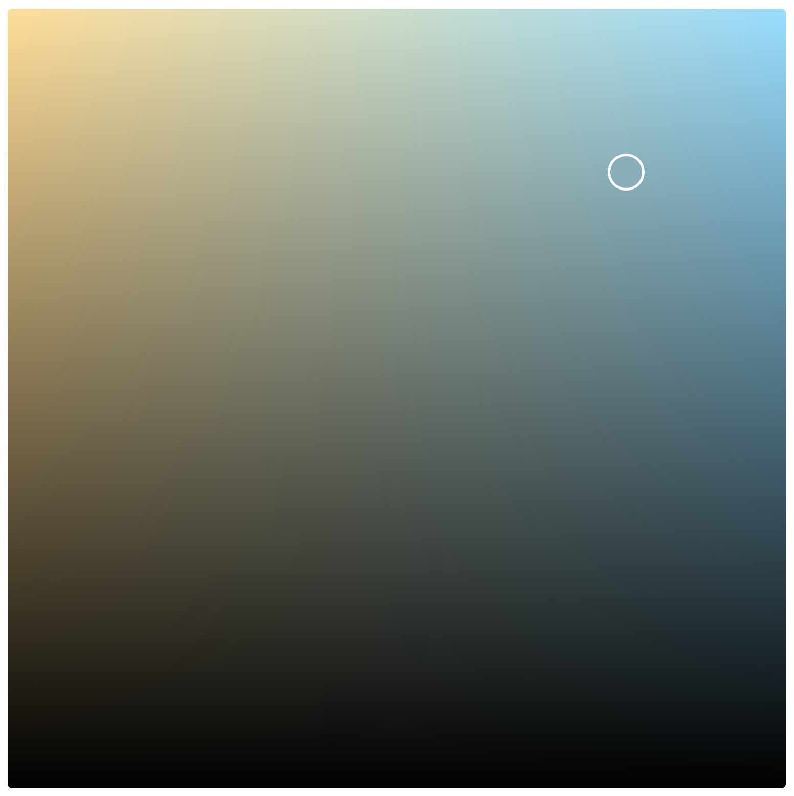
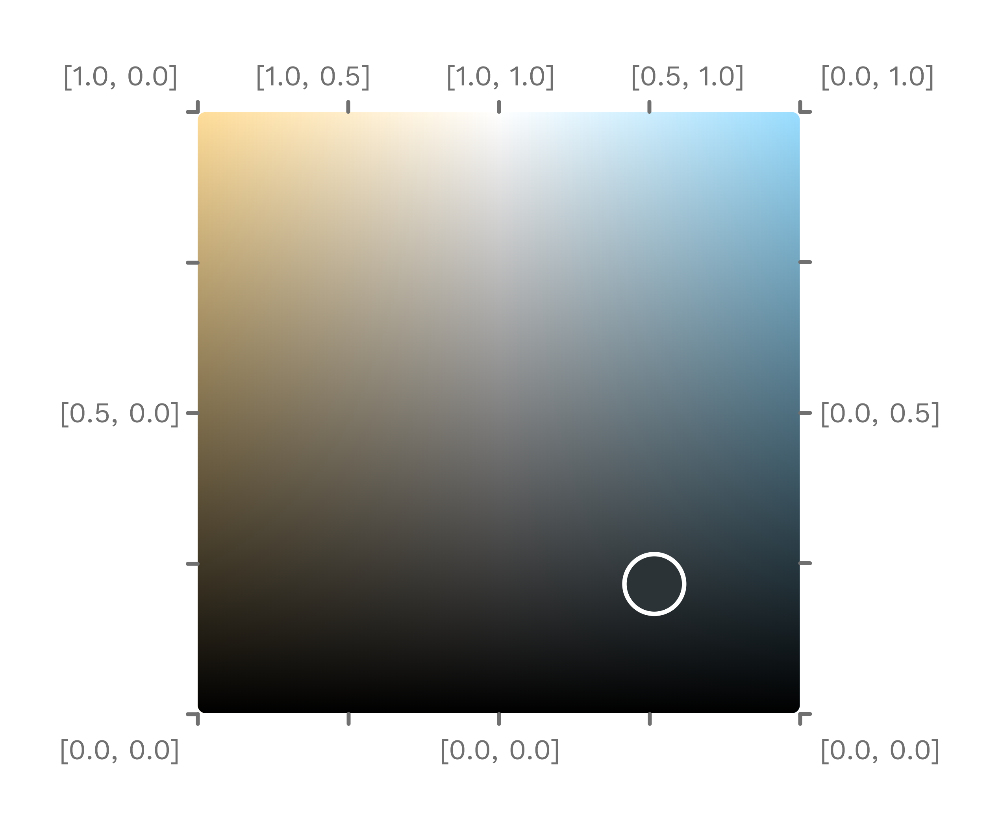

# @adrianjost/two-channel-picker

[](https://www.npmjs.com/package/@adrianjost/two-channel-picker) [](https://dependabot.com) [](https://david-dm.org/adrianjost/two-channel-picker) [](https://david-dm.org/adrianjost/two-channel-picker?type=dev) [](https://two-channel-picker.adrianjost.dev/demo.html)

> A simple two channel Color Picker

▶️ Demo: [https://two-channel-picker.adrianjost.dev/demo.html](https://two-channel-picker.adrianjost.dev/demo.html)

## About

I needed an intuitive color picker to control my warm-white-cold-white (WWCW) LED Strips with the [SmartLight Project](https://github.com/adrianjost/SmartLight-Web-Client).

<p align="center">
  
</p>

The picker value is therefore indepent from the displayed color. The given value is a number between 0 and 1 for each of the two channels. The brightness can be determined by dragging the slider along the Y-axis. Dragging along the X-axis changes the relationship between the two channels.

<p align="center">
  
</p>

## Usage

### As a native Web Component

```html
<script src="https://cdn.jsdelivr.net/npm/@adrianjost/two-channel-picker@0.3.6/dist/wc/two-channel-picker.min.js"></script>

<div style="width: 300px; height: 300px;">
	<two-channel-picker
		value="[0,1]"
		id="picker"
		options='{"colorLeft": "#f00", "colorRight": "#00f" }'
	></two-channel-picker>
</div>

<script>
	document.getElementById("picker").addEventListener("input", (event) => {
		console.log(event.detail[0]);
	});
</script>
```

> please note, that you may need to adjust the version number in the url.

### with VueJS

#### Vue 2

Don't worry about the <1 version number. I haven't found any issues in the last 2 years so v1 will use an identical implementation, but is vue3 compatible.

```bash
npm i @adrianjost/two-channel-picker
# or
yarn add @adrianjost/two-channel-picker
```

#### Vue 3

```bash
npm i @adrianjost/two-channel-picker@next
# or
yarn add @adrianjost/two-channel-picker@next
```

#### Usage in your App

```vue
<template>
	<TwoChannelPicker
		v-model="channels"
		:options="{
			colorLeft: '#fd9',
			colorRight: '#9df',
			marker: {
				radius: 16,
				borderWidth: 2,
			},
		}"
	/>
</template>

<script>
import TwoChannelPicker from "@adrianjost/two-channel-picker";

export default {
	components: {
		TwoChannelPicker,
	},
	data() {
		return {
			channels: [0, 1],
		};
	},
};
</script>
```

### Helper

The package also includes some helper methods. You can access them by importing the according js files. Please use the JSDoc comments to learn how to use them.

```js
import {
	getChannelsForHueAndBrightness,
	getHueAndBrightnessForChannels,
	getCenterColor,
	getColorForHueAndBrightness,
	getColorForChannels,
} from "@adrianjost/two-channel-picker/dist/helpers/channelColor.js";
```

```js
import {
	hex2rgb,
	rgb2hex,
} from "@adrianjost/two-channel-picker/dist/helpers/colorConversion.js";
```

## API

### Props

You can customize the picker with the following props/attributes.

> When using the lib as a web component you must provide all attributes `JSON.stringify()`-ed.

| attribute | type | default value | description |
| --- | --- | --- | --- |
| `value` / `v-model` | Array, String | `[1,0]` | the current channel values, if provided as a String, this must be `JSON.parse()`-able |
| `options` | Object | `{}` | all your config goes in here |

#### Options

Available Attributes in the `options` prop:

| attribute | type | default value | description |
| --- | --- | --- | --- |
| `readOnly` | Boolean | `false` | should the user be able to move the marker? |
| `colorLeft` | String | `#fd9` | the color in the top left corner. Must be in the HEX Format with 3 or 6 digits. |
| `colorRight` | String | `#fd9` | the color in the top right corner. Must be in the HEX Format with 3 or 6 digits. |
| `marker.borderWidth` | Number | `2` | The border width of the active marker in px. |
| `marker.radius` | Number | `16` | The border radius including the borderWidth in px. |

You need more options? Please open an issue and I will do my best to implement it. Pull Requests are also welcome!
